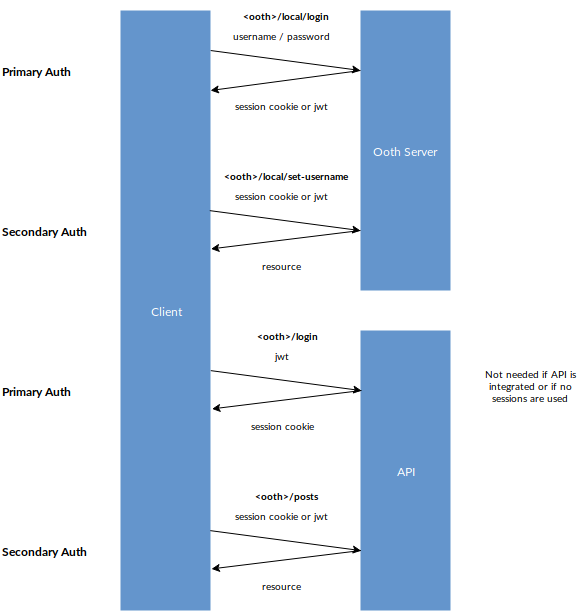

# Ooth - a user identity management system

Welcome to the ooth documentation.

<!-- START doctoc generated TOC please keep comment here to allow auto update -->
<!-- DON'T EDIT THIS SECTION, INSTEAD RE-RUN doctoc TO UPDATE -->


- [What is Ooth](#what-is-ooth)
  - [Architecture](#architecture)
- [Tutorial](#tutorial)
- [Ooth Server](#ooth-server)
  - [Server app](#server-app)
  - [Ooth backend](#ooth-backend)
  - [Ooth](#ooth)
  - [Start Application](#start-application)
- [Ooth Client](#ooth-client)
  - [Get the current user status](#get-the-current-user-status)
  - [Subscribe to the user object](#subscribe-to-the-user-object)
    - [Real-time user changes with Websockets](#real-time-user-changes-with-websockets)
  - [Log in](#log-in)
  - [Log out](#log-out)
- [Authentication flow (sessions vs JWT)](#authentication-flow-sessions-vs-jwt)
- [Securing a resources API](#securing-a-resources-api)
  - [Ooth server](#ooth-server)
  - [API](#api)
  - [Express Routes](#express-routes)
  - [Apollo GraphQL server](#apollo-graphql-server)
- [Authentication strategies](#authentication-strategies)
  - [Guest login](#guest-login)
    - [Server](#server)
    - [Client](#client)
  - [Local (username, email, password)](#local-username-email-password)
    - [Server](#server-1)
      - [Sending Emails](#sending-emails)
    - [Client](#client-1)
      - [Register](#register)
      - [Login](#login)
      - [Verify email](#verify-email)
      - [Set email](#set-email)
      - [Generate verification token (to send new verification email)](#generate-verification-token-to-send-new-verification-email)
      - [Set username](#set-username)
      - [Change password](#change-password)
      - [Forgot password](#forgot-password)
      - [Reset password](#reset-password)
  - [Facebook](#facebook)
    - [Server](#server-2)
    - [Client](#client-2)
  - [Google](#google)
    - [Server](#server-3)
    - [Client](#client-3)
  - [Twitter](#twitter)
    - [Server](#server-4)
    - [Client](#client-4)
  - [Authy (Twilio)](#authy-twilio)
    - [Server](#server-5)
    - [Client](#client-5)
- [Managing the user](#managing-the-user)
  - [Profile Data](#profile-data)
    - [Server](#server-6)
    - [Client](#client-6)
  - [User roles](#user-roles)
    - [Server](#server-7)
    - [Client](#client-7)
- [UI](#ui)
  - [React](#react)
    - [Provider](#provider)
    - [Getting user from context](#getting-user-from-context)
    - [Getting ooth client from context](#getting-ooth-client-from-context)
  - [Next.js](#nextjs)
- [Examples](#examples)
  - [Vanilla JS](#vanilla-js)
  - [Vue.js](#vuejs)
  - [With create-react-app](#with-create-react-app)
  - [With UI and next.js](#with-ui-and-nextjs)

<!-- END doctoc generated TOC please keep comment here to allow auto update -->

## What is Ooth

Ooth is a series of javascript libraries to help you manage user accounts with node.js.

### Architecture

A typical scenario has 3 components:

- The authentication / identity management server
- A resource API (optional, can be integrated with the auth server or standalone)
- The client

## Tutorial

The most complete example with a starting UI with all the main user account flow is programmed with next.js. See the full tutorial [here](./next.md)

## Ooth Server

### Server app

To set up ooth server you need to create a server app, e.g. `express`:

```js
const express = require("express");
const app = express();
```

If the client is going to run on another host than the ooth server, enable cors:

```js
const cors = require("cors");

const corsMiddleware = cors({
  origin: "http://localhost",
  credentials: true,
  preflightContinue: false
});
app.use(corsMiddleware);
app.options(corsMiddleware);
```

### Ooth backend

You will need a backend to allow ooth to communicate with some form of storage, e.g. `ooth-mongo`.

```js
const { MongoClient } = require("mongodb");
const { OothMongo } = require("ooth-mongo");

const client = await MongoClient.connect(`${MONGO_HOST}/${MONGO_DB}`);
const db = client.db(MONGO_DB);
const backend = new OothMongo(db);
```

### Ooth

```js
const { Ooth } = require('ooth')
const ooth = new Ooth({
    app, // required,
    backend, // required
    path: '/auth', // optional, default '/'
    sessionSecret: SESSION_SECRET, // optional, will set up cookie based express sessions, can be any long random string
    defaultLanguage: 'en', // optional,
    translations: {...}, // optional, use to override ooth texts
})
// <- Register all plugins here!
```

Further down we will discuss the plugins needed in different scenarios.

If you want to use ooth-client you will need `ooth-user` to inject the user object in the response:

```js
const oothUser = require("ooth-user").default;

oothUser({ ooth });
```

### Start Application

Then you can start the application:

```js
app.listen(3000, () => {
  console.log("Online!");
});
```

## Ooth Client

On the client side, you need `ooth-client`.

```js
const { OothClient } = require('ooth-client')

const ooth = new OothClient({
    url: 'http://localhost:3002/auth',
    secondaryAuthMode: 'session' // for cookie-based session, or 'jwt' (vulnerable to XSS in browser, preferred solution on mobile apps)
    api: { // Optional, use if you have an api with resources to make authenticated calls to
      url: 'http://localhost:3003',
      primaryAuthMode: 'jwt', // Optional, use *only if* you have to create a *new* cookie-based session
      secondaryAuthMode: 'session', // for cookie-based session
      loginPath: '/login', // Optional, use only if primaryAuthMode is 'jwt'
      logoutPath: '/logout', // Optional, use only if primaryAuthMode is 'jwt'
    },
    ws: true // Optional, subscribes to user changes with websocket, you need `ooth-ws` on client for this
})

const user = await ooth.start()
```

### Get the current user status

```js
const status = await ooth.user();
```

### Subscribe to the user object

To react to changes in user status (login/logout/updates), subscribe to the user object like this:

```js
const sub = user => console.log("User is", user);
ooth.on("user", sub);
```

To unsubscribe:

```js
ooth.unsubscribe("user", sub);
```

#### Real-time user changes with Websockets

If you want to automatically update clients using the same session (e.g. on different browser tabs) you need to use websockets.

On server:

```js
const oothWs = require("ooth-ws").default;
oothWs({
  ooth
});
```

On client:

```js
new OothClient({
  // ...
  ws: true
});
```

### Log in

Well, the way you log in depends on the plugins you installed on the server,
as a general rule you will use:

```js
const user = await ooth.authenticate(strategyName, methodName, data);
```

### Log out

```js
await ooth.logout();
```

## Authentication flow (sessions vs JWT)

**Primary authentication** is when the user first authenticates towards a server, e.g. with a username/password pair.
The client usually gets a session cookie or a JWT in exchange.

**Secondary authentication** is when the client performs an authenticated request using a session cookie or a JWT.

If your application has an API (for more details see [Securing a resources API](#securing-a-resources-api) section below) we also need to distinguish between:

1. Primary auth towards ooth
2. Secondary auth towards ooth
3. Primary auth towards API
4. Secondary auth towards API



`ooth-local`, `ooth-guest`, `ooth-facebook`, `ooth-google` are all primary authentication strategies.
This set of strategies should grow in the future and it should be easy to just build new ones building on existing passport.js strategies (openid or oauth, anyone?). See the details for these strategies below.

Secondary authentication mainly boils down to sessions or JWT. Both have advantages and disadvantages.

- Cross-server usage: sessions only work with a single host, JWTs can be transfered.
- Client storage: sessions can be stored in HTTP-only cookies (thus be unreachable by JS), JWTs have to be stored e.g. in `localStorage` which can be a XSS vulnerability
- State: session are stateful, JWTs are stateless

My recommendation is: on mobile, just use JWTs, on browser use sessions as much as possible.
If you have to use JWTs use them to create sessions and discard them as early as possible.

| Scenario                          | Ooth primary auth | Ooth secondary auth | API primary auth | API secondary auth | Ooth server config       | Ooth client config                                                                                                                            |
| --------------------------------- | ----------------- | ------------------- | ---------------- | ------------------ | ------------------------ | --------------------------------------------------------------------------------------------------------------------------------------------- |
| Ooth only, mobile                 | any               | jwt                 | n.a              | n.a                | `ooth-jwt`               | `secondaryAuthMode: 'jwt'`                                                                                                                    |
| Ooth only, browser                | any               | session             |                  |                    | `sessionSecret`          | `secondaryAuthMode: 'session'`                                                                                                                |
| Ooth with API, mobile             | any               | jwt                 | none             | jwt                | `ooth-jwt`               | `secondaryAuthMode: 'jwt', api: { secondaryAuthMode: 'jwt' }`                                                                                 |
| Ooth with integrated API, browser | any               | session             | none             | session            | `sessionSecret`          | `secondaryAuthMode: 'session', api: { secondaryAuthMode: 'session' }`                                                                         |
| Ooth with standalone API, browser | any               | session             | jwt              | session            | `sessionSecret ooth-jwt` | `secondaryAuthMode: 'session', api: { primaryAuthMode: 'jwt', secondaryAuthMode: 'session', loginPath: LOGIN_PATH, logoutPath: LOGOUT_PATH }` |

## Securing a resources API

If your API is provided by the same express app used by ooth, the user object will automatically be injected in the session. **Nothing to do here.**

If, on the other hand, you are using ooth as a _standalone_ microservice, read along.

### Ooth server

You will need to register the `ooth-jwt` plugin:

```js
const oothJwt = require("ooth-jwt").default;

oothJwt({
  ooth, // Required
  sharedSecret: SHARED_SECRET // Can be any long random string, needs to be shared with the API,
  tokenLocation: 'header' // Place to read token from. Can be 'body', 'header' or 'both'. Defaults to 'both'
});
```

You can also use asymetric encryption instead of shared secret:

```js
oothJwt({
  ooth, // Required
  privateKey: fs.readFileSync("path/to/private.key"),
  publicKey: fs.readFileSync("path/to/public.key"),
  algorithm: ALGORITHM_TO_USE, // Defaults to 'RS256'. Used only if a publicKey / privateKey pair is provided
  tokenLocation: 'header'
});
```

You must provide either a sharedSecret, or a privateKey/publicKey pair

#### tokenLocation

The 'tokenLocation' option is used to specify where (in the request) to read the token from. 'body' means read from the request body ('token' parameter), 'header' means read from the request Authorization header; and 'both' enables both methods.

The encouraged option is 'header', as standard JWT implementation is to use the Authorization header for the token.

Also, if you use 'ooth-jwt' together with 'ooth-local', 'body' or 'both' will conflict with 'reset-password' and 'verify-email' methods.

### API

We'll assume the API is another express app. Here too, you need to enable cookie-based session:

```js
app.use(
  session({
    name: "api-session-id",
    secret: API_SESSION_SECRET, // a long random string
    resave: false,
    saveUninitialized: true
  })
);
```

If the client runs on another host than the api, enable cors:

```js
const cors = require("cors");

const corsMiddleware = cors({
  origin: "http://localhost",
  credentials: true,
  preflightContinue: false
});
app.use(corsMiddleware);
app.options(corsMiddleware);
```

Additionally, add the functionality to log in with a JWT (and log out):

```js
const passport = require('passport')
const JwtStrategy = require('passport-jwt).Strategy
const ExtractJwt = require('passport-jwt).ExtractJwt
app.use(passport.initialize())
app.use(passport.session())
passport.serializeUser((userId, done) => done(null, userId))
passport.deserializeUser((userId, done) => done(null, userId))
passport.use('jwt', new JwtStrategy({
    secretOrKey: SHARED_SECRET_OR_KEY, // this should either be the sharedKey or the publicKey you used in the ooth config
    jwtFromRequest: ExtractJwt.fromAuthHeaderWithScheme('jwt'),
}, (payload, next) => {
    if (!payload.user || typeof payload.user !== 'string') {
        console.error(payload)
        return next('Malformed token payload.')
    }
    return next(null, payload.user)
}))
app.post('/login', passport.authenticate('jwt', (req, res) => {
    res.send({
        message: 'Logged in successfully.',
    }),
}))
app.post('/logout', (req, res) => {
    req.logout()
    res.send({
        message: 'Logged out successfully.',
    }),
})
```

### Express Routes

The user object is added to the request by the session middleware:

```js
app.get("/data", (req, res) => {
  if (req.user) {
    // user is authenticated
  } else {
    // user is not authenticated
  }
});
```

### Apollo GraphQL server

To have access to the user id in apollo server, inject it into the context:

```js
app.use(
  "/graphql",
  bodyParser.json(),
  graphqlExpress((req, res) => {
    return {
      schema, // your graphql schema, see apollo documentation
      context: { userId: req.user && req.user._id }
    };
  })
);
```

You can then, in a resolver, react like this:

```js
const resolvers = {
  Query: {
    data: async (root, args, { userId }, info) => {
      if (!userId) {
        throw new Error("User not logged in.");
      }

      // return data
    }
  }
};
```

## Authentication strategies

### Guest login

#### Server

This is a very simple plugin that allows anyone to just create a guest session. Each time a new user is created.

```js
const oothGuest = require("ooth-guest").default;

oothGuest({ ooth });
```

This will register route `<ooth>/guest/register` which you can call with OothClient to start a session (integrated) or get a JWT (standalone).

#### Client

To create a guest session:

```js
const user = await ooth.authenticate("guest", "register");
```

### Local (username, email, password)

This one is a doozy. It handles all the details of local authentication, i.e. the creation of username/email/password accounts, the handling of email verification, forgotten passwords and so on.

#### Server

```js
const oothLocal = require("ooth-local").default;
oothLocal({ ooth });
```

##### Sending Emails

`ooth-local` still requires you to deal with the handling of key events (i.e. the sending of emails). This is where `ooth-local-emailer` comes in that sends some minimal functional emails. You still need to define an actual method to send emails, for example:

```js
const mailcomposer = require("mailcomposer");
const Mg = require("mailgun-js");
const Mailgun = Mg({
  apiKey: "XXX",
  domain: "XXX"
});
function sendMail({ from, to, subject, body, html }) {
  return new Promise((resolve, reject) => {
    const mail = mailcomposer({
      from,
      to,
      subject,
      body,
      html
    });
    mail.build((e, message) => {
      if (e) {
        return reject(e);
      }
      Mailgun.messages().sendMime(
        {
          to,
          message: message.toString("ascii")
        },
        (e, r) => {
          if (e) {
            return reject(e);
          }
          resolve(e);
        }
      );
    });
  });
}
```

you then register your local strategy like this:

```js
const oothLocalEmailer = require('ooth-local-emailer')
oothLocalEmailer({
  ooth,
  from: 'info@example.com',
  siteName: 'My Example Site',
  sendMail,
}))
```

`oothLocalEmailer` also takes optional `urls`, `translations` and `defaultLanguage` objects that allows you to overwrite the structure of redirect urls (e.g. the password reset url) or of the whole emails.

#### Client

##### Register

```js
await ooth.method("local", "register", {
  email,
  password
});
```

##### Login

```js
const user = await ooth.authenticate("local", "login", {
  username, // can also be an email
  password
});
```

##### Verify email

```js
await ooth.method("local", "verify", {
  token, // verification token
  userId
});
```

##### Set email

```js
await ooth.method("local", "set-email", {
  email
});
```

##### Generate verification token (to send new verification email)

```js
await ooth.method("local", "generate-verification-token");
```

##### Set username

```js
await ooth.method("local", "set-username", {
  username
});
```

##### Change password

```js
await oothClient.method("local", "change-password", {
  password,
  newPassword
});
```

##### Forgot password

```js
await oothClient.method("local", "forgot-password", {
  username // can be email
});
```

##### Reset password

```js
await oothClient.method("local", "reset-password", {
  userId,
  token,
  newPassword
});
```

### Facebook

#### Server

```js
const oothFacebook = require("ooth-facebook").default;
oothFacebook({
  ooth,
  clientID,
  clientSecret
});
```

#### Client

See [this component](https://github.com/nmaro/staart/blob/master/packages/staart/src/components/login-facebook.js)

### Google

#### Server

```js
const oothGoogle = require("ooth-google").default;
oothGoogle({
  ooth,
  clientID,
  clientSecret
});
```

#### Client

See [this component](https://github.com/nmaro/staart/blob/master/packages/staart/src/components/login-google.js)

### Twitter

#### Server

```js
const oothTwitter = require("ooth-twitter").default;
oothTwitter({
  ooth,
  clientID: process.env.TWITTER_CLIENT_ID,
  clientSecret: process.env.TWITTER_CLIENT_SECRET,
  callbackUrl: process.env.TWITTER_CALLBACK_URL
});
```

#### Client

See [this](https://github.com/nmaro/staart/blob/master/packages/staart/src/components/login-twitter.js) for the log in part
and [this](https://github.com/nmaro/staart/blob/master/examples/staart/next/pages/oauth/twitter.js) for the redirect page.

### Authy (Twilio)

#### Server

```js
const oothAuthy = require("ooth-authy").default;
oothAuthy({
  ooth,
  apiKey: process.env.AUTHY_API_KEY
});
```

#### Client

There is no client UI implementation available yet, but these are the necessary ooth client calls:

```js
// Register
await client.method("authy", "register", {
  email: "example@example.com",
  cellphone: "1234567",
  country_code: "41"
});

// Login
await client.method("authy", "otp", { email: "example@example.com" });
// User gets an SMS with the token
await client.authenticate("authy", "login", {
  email: "example@example.com",
  token: 1234567
});
```

## Managing the user

### Profile Data

#### Server

The `ooth-profile` package is not there to log in or register, but to simply define some user fields that the user can set.

```js
const oothProfile = require("ooth-profile").default;
oothProfile({
  ooth,
  fields: {
    firstName: {},
    lastName: {},
    age: {
      validate(value, user) {
        if (Number.isNaN(value)) {
          throw new Error(`Age is not a number: ${value}.`);
        }
        if (value < 0 || value > 150) {
          throw new Error(`Age out of bounds ${value}.`);
        }
      }
    }
  }
});
```

#### Client

With `ooth-profile` set up on the server.

```js
await oothClient.method('profile', 'update', {
  firstName: 'John',
  lastName: 'Smith',
  age: 20,
}
```

### User roles

#### Server

```js
const oothRoles = require("ooth-roles").default;
oothRoles({
  ooth
});
```

Only users with the role `admin` can set roles, so you need to bootstrap the system by setting a role manually, e.g. with mongodb:

```js
db.collection("users").update(
  {
    _id: ObjectId("XXX")
  },
  {
    $set: {
      roles: ["admin"]
    }
  }
);
```

#### Client

With `ooth-roles` set up on the server. You need to have the role 'admin' to be able to do it:

```js
await oothClient.method("roles", "set", {
  userId: "XXX",
  roles: ["editor", "author"] // will overwrite all previous roles the user had
});
```

## UI

Do you need readymade UI components, or even a whole starter boilerplate that integrates all of the above? Check out [staart](https://github.com/nmaro/staart).

### React

`ooth-client-react` provides higher-order-component that takes care of subscribing to the user object and rerendering, and injecting the user into the context.

#### Provider

Add the provider somewhere close to the root of your app:

```js
const { OothProvider } = require("ooth-client-react");

const App = () => <OothProvider client={ooth}>// your app</OothProvider>;
```

#### Getting user from context

```js
const { withUser } = require("ooth-client-react");
const MyPureComponent = ({ user }) => <p>Your id is {user._id}</p>;
const MyComponent = withUser(MyPureComponent);
```

#### Getting ooth client from context

```js
const { withOoth } = require("ooth-client-react");
class RegisterComponent extends React.Component {
  render() {
    return (
      <form
        onSubmit={e => {
          e.preventDefault();
          return this.props.oothClient
            .authenticate("local", "login", {
              username: this.loginEmail.value,
              password: this.loginPassword.value
            })
            .catch(e => {
              alert(e.message);
            });
        }}
      >
        <div>
          <label>
            E-Mail{" "}
            <input
              ref={ref => (this.loginEmail = ref)}
              id="register-email"
              type="email"
            />
          </label>
        </div>
        <div>
          <label>
            Password{" "}
            <input
              ref={ref => (this.loginPassword = ref)}
              id="register-password"
              type="password"
            />
          </label>
        </div>
        <button>Register</button>
      </form>
    );
  }
}
const Register = withOoth(RegisterComponent);
```

### Next.js

The above pattern of embedding a `ooth-client-react` provider in your page components won't work with next.js server rendering. You need to handle that stuff in next.js genius function `getInitialProps`. Luckily there is a function that handles that for you: `ooth-client-react-next`.

```
// I recommend keeping these two lines along with the initialization of the ooth client in a separate file
// You will need to wrap every page with this provider
// If the wrapped child implements `getInitialProps` the wrapper will take care of calling it
const withOothNext = require('ooth-client-react-next')
const withOothNextProvider = withOothNext(ooth)

const PageComponent = () => <p>Hello World</p>
const Page = withOothNextProvider(PageComponent)
export default Page
```

Note: Ooth can't be used standalone with next.js. In fact, client, api and next.js server need to run in the same process to work.

## Examples

There are many ways you can use ooth.

### Vanilla JS

A good starting point could be this minimal example. Reading through the two files of client and server code is recommended.

- [minimal](https://github.com/nmaro/ooth/examples/minimal)

Note that this example doesn't use `ooth-client` but performs queries to the server directly.

### Vue.js

The same minimal example as Vanilla JS, but using [Vue.js](https://vuejs.org/).

- [minimal-vue](https://github.com/nmaro/ooth/examples/minimal-vue)

Note that this example doesn't use `ooth-client` but performs queries to the server directly.

### With create-react-app

The following two examples use create-react-app as a client. If you don't want to use cra you can still analyze the server folders and the code parts that use ooth-client independently. Both examples can be run with Docker-Compose.

- [standalone](examples/standalone) - ooth runs as a microservice separate from api, auth transfer is done via JWT.
- [integrated](examples/integrated) - ooth runs in same process as api, no need for JWT.

### With UI and next.js

The most complete example with a starting UI with all the main user account flow is programmed with next.js. See the full explanation [here](./next.md)
