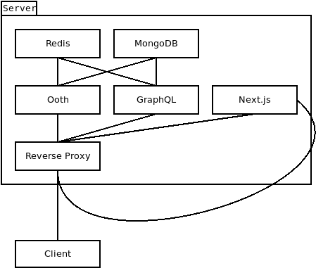
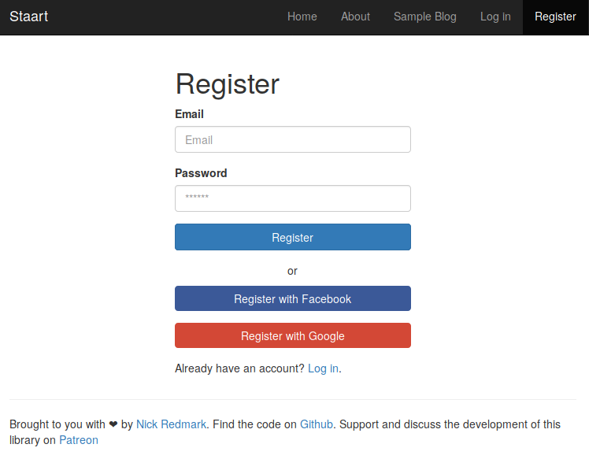
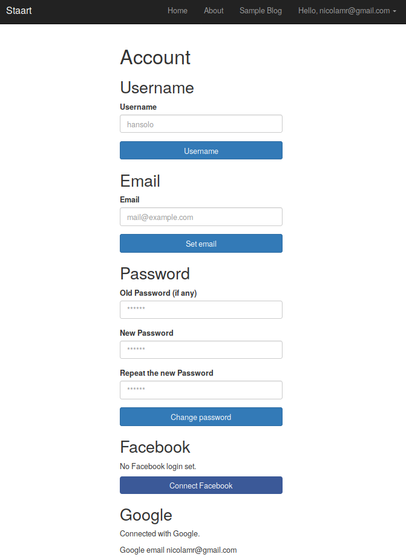
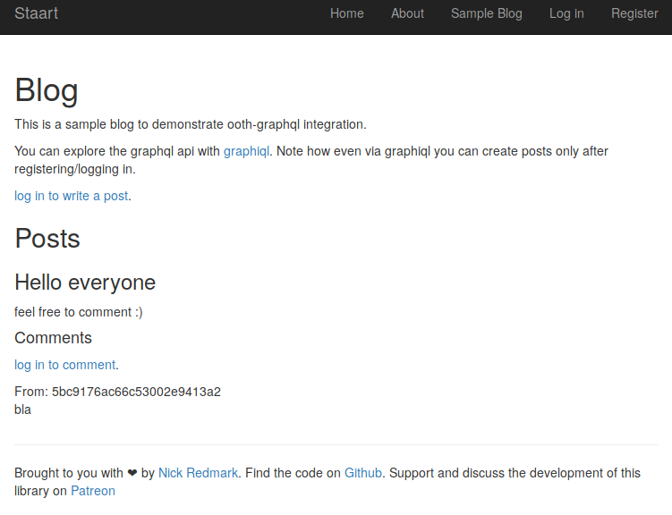
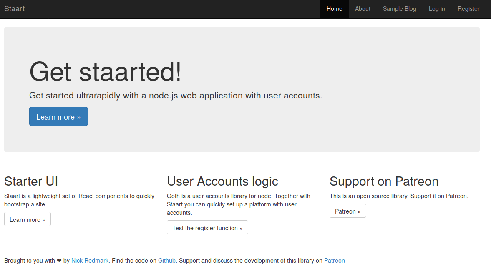

# User Accounts with Next.js - An Extensive Tutorial

This was also posted as a [medium article](https://medium.com/the-ideal-system/user-accounts-with-next-js-an-extensive-tutorial-6831cdaed16b).

There is an [issue on the next.js](https://github.com/zeit/next.js/issues/153) repo that has been open since the early days of the project (October 2016),
it's called [Add login / authentication example](https://github.com/zeit/next.js/issues/153) and is one of 2 issues tagged [Priority: OMG Maximum](https://github.com/zeit/next.js/labels/Priority%3A%20OMG%20Maximum). The issue has 185 comments, many of which mine.

As I've written elsewhere, [Next.js](https://nextjs.org/) has been my gateway out of [Meteor.js](https://www.meteor.com/) and into the pure [Node.js](https://nodejs.org) world,
a transition that mirrored Arunoda's, a meteor thought leader in the old days, now working for [ZEIT](https://zeit.co/), the company behind Next.js (a bit of history trivia from [the Year of JavaScript Fatigue](https://medium.com/@ericclemmons/javascript-fatigue-48d4011b6fc4)).

A killer feature of Meteor.js was the accounts system.
I've never seen anything in JavaScript land getting anywhere close to the ease of use you would get with meteor to bootstrap user identity management.
But meteor had some other problems, the main one being it's a tighly coupled monolythic mess (really).
If there is something I learned from trying to escape it is that the UNIX principle (do one thing and do it well) really is golden.
Libraries need a lot of glue, but they outlive frameworks that do a lot of the magic for you.

To approach the ease of creating an accounts system I experienced with meteor.js, I developed [ooth](https://github.com/nmaro/ooth), a set of npm packages (a core server package, a core client package, and a number of plugins) built on top of passport.js to manage user accounts. The repo now has 376 stars and I've been using it regularly.

<!-- START doctoc generated TOC please keep comment here to allow auto update -->
<!-- DON'T EDIT THIS SECTION, INSTEAD RE-RUN doctoc TO UPDATE -->


- [Time for a Comprehensive Tutorial](#time-for-a-comprehensive-tutorial)
- [So You Want User Accounts](#so-you-want-user-accounts)
- [How to Keep the User Logged In: Cookie-Based Sessions or JWTs?](#how-to-keep-the-user-logged-in-cookie-based-sessions-or-jwts)
- [But, But, I Want Microservices!](#but-but-i-want-microservices)
- [Project Structure](#project-structure)
- [Reverse Proxy](#reverse-proxy)
- [Authentication Microservice (Ooth)](#authentication-microservice-ooth)
- [API](#api)
- [The Next.js App](#the-nextjs-app)
  - [Next.js Providers and Composing getInitialProps with `compose-next`](#nextjs-providers-and-composing-getinitialprops-with-compose-next)
  - [Layout](#layout)
  - [Pages](#pages)
- [There You Have It!](#there-you-have-it)

<!-- END doctoc generated TOC please keep comment here to allow auto update -->

## Time for a Comprehensive Tutorial

For a good introduction check out the [talk about ooth I gave](https://vimeo.com/287978291#t=682s) at the FrontendConf in Zurich. If you are looking for a broad overview of ooth's features check out the [documentation](https://nmaro.github.io/ooth/).

The main problem: because I wanted to provide a large number of options, ooth has a high learning curve. People have been crying for a tutorial.
But it's hard to create a tutorial that will make everyone happy (precisely because of the high number of ways one can approach and think about user authentication and user accounts/identity management).

Which is why I'm writing this article. Here you will find an ooth tutorial, providing you not the simple-as-possible hello world example (there are enough of those in the repo), but the opinionated, reasoned this-is-the-way-you-do it example. This is why I use next.js here: because I personally believe it is the right tool looking to the future (more precisely, because of its genius concept of component lifecycles that start on the server and continue on the client, giving you SSR and other advantages).

To a certain degree this is a brain dump of everything I've been learning about this topic in the past year or two. Let's jump into it.

For quick satisfaction run the following commands now to have a working example (you need node 10 and docker-compose installed):

```
git clone https://github.com/nmaro/staart
cd staart/examples/staart
npm run bootstrap
npm run start:local
```

Access the app at [http://localhost:8080](http://localhost:8080). The same example is available at [staart.nmr.io](https://staart.nmr.io).

Note: Facebook/Google login and sending mails won't work because these features would require you to create some accounts and configure the app, but don't worry about that for now.

I'm happy to discuss details with you on [slack](https://join.slack.com/t/ooth/shared_invite/enQtMjQ3MDE2ODA2NjE0LTE1NGNmN2YzZTdiMWNjODExZmNjYzg3ZGJjZmVmZmI2YjVhOWYzZDQ1NWI4Y2JiNzNlMmI2Y2U5ZWFhODIzMWQ) - I usually respond within hours.

## So You Want User Accounts

Let's clarify a few concepts:

- **Authentication** is a mechanism through which a server can verify a client's identity.
- **Authorization** is a mechanism through which a server decides whether a client has access to or can modify a specific resource.
- **User identity management** is a system with which the server stores, updates etc. the user identity, in particular the credentials needed for authentication. Also known as **user accounts**.

The de facto solution for user authentication in JavaScript land is [Passport.js](http://www.passportjs.org/).
Which is why I didn't reinvent the wheel and let ooth depend heavily on passport.js packages.
Authorization is out of scope and I won't discuss it here.
It's _user identity management_ that passport.js leaves as an exercise to the reader (and that meteor did so well).

> **Our mission:** to provide a number of strategies with which the user can authenticate and manage the user session and required credentials properly.

More concretely, we want our user to be able to log in with _Facebook_, _Google_, and with a classic username-or-email/password pair.
We want to handle all the flows that this requires, such as discovering overlapping emails, registration, forgot password, reset password etc. Luckily, ooth takes care of most of that for us, it's a matter of configuring it.
But before we jump into it we have to discuss another issue that complicates things, namely how we want to handle the user "session".

## How to Keep the User Logged In: Cookie-Based Sessions or JWTs?

There are two main strategies to keep the user logged in: cookie-based sessions or JWTs (Json Web Tokens).

With **sessions** the server creates a session ID that it sends you as a cookie.
At the same time it associates a user id with that session ID.
That association can be stored in memory or in some form of storage (a db, or redis...).
The two main disadvantages of this approach are:

- You can't transfer your session across domains (because of how cookies work).
- It's stateful (honestly I don't really get why this is a problem but it's often listed as a downside)

JWTs are tokens signed by the server that certify that the holder of the token has a certain identity.
The client can provide the JWT back to the server (or to another server!) which can then verify the caller's identity.
JWTs have an expiry date, after which the user usually has to log in again.
The advantages of this solution are that it is stateless and can be used for authentication across domains.
But that's not the whole story.

Common practices associated with JWT are refresh tokens with which the client can request a new JWT.
The server can also create a token blacklist to revoke certain tokens.
The problem with these practices is that they aren't stateless, thus eliminating one of the advantages of JWT.

The other issue is that to transfer the JWT across domains the client has to store it somewhere, usually in `localStorage`.
In case of an XSS injection, the attacker could steal the token and thus impersonify the user towards any server that accepts such tokens.
This is not an issue if the client is a non-browser application, such as a desktop app, another api or a desktop app.

Long story short, here is the way I think about it:

- If you _absolutely need_ cross-location auth use JWT <- but if possible avoid because of security.
- If you need to auth from any client that is not a browser and doesn't have the XSS issue (e.g. a desktop or mobile app) use JWTs.
- Otherwise, use cookie-based sessions.

## But, But, I Want Microservices!

So do I! In this tutorial we are going to build an example with 3 main components:

- An authentication microservice (Ooth)
- An API (based on GraphQL, but it could be REST)
- Next.js

But this doesn't force you to use JWTs. Here's how you solve the problem with sessions:

1. You use a reverse proxy that maps various subroutes of the same domain to the different microservices (e.g. `/auth` goes to ooth, `/api` goes to the API, and `/` goes to the Next.js app), this allows your browser to share the cookies across microservices
2. You use a shared session storage (in our case we'll be using [redis](https://redis.io/))

Add to it a database for user and other data storage, and we end up with the following architecture:



All of this we will glue together with docker-compose (you could use kubernetes for a more enterprise solution).

But let's get started already!

## Project Structure

Our application will have the following folder structure:

```
.
├── api
├── next
├── ooth
├── proxy
├── docker-compose.local.yml
├── docker-compose.yml
├── .env
```

Let's look at the docker-compose.yml file:

```
version: '3'
services:
  db:
    image: mongo
    volumes:
      - ./db:/data/db
  redis:
    image: redis
  next:
    build: ./next
    env_file: ./next/.env
  ooth:
    build: ./ooth
    env_file: ./ooth/.env
  api:
    build: ./api
    env_file: ./api/.env
  proxy:
    build: ./proxy
    env_file: ./proxy/.env
    ports:
      - '$PORT:8080'
```

We have all the services mentioned before. The proxy is the only thing that's really exposed. To set the $PORT variable you can use the `.env` file:

```
PORT=8080
```

When running things locally, we want everything to be easily accessible, so we add some config in a separate `docker-compose.local.yml` file (note that these settings would be dangerous on production as they would expose all services to the outer world):

```
version: '3'
services:
  db:
    network_mode: host
  redis:
    network_mode: host
  next:
    network_mode: host
  ooth:
    network_mode: host
  api:
    network_mode: host
  proxy:
    network_mode: host
```

We yet have to create everything, but as a foreshadowing, locally you would start all services with

```
docker-compose -f docker-compose.yml -f docker-compose.local.yml up --build
```

but in development you want to run the components you are developing locally, so you'd start only the rest with docker, e.g.

```
docker-compose -f docker-compose.yml -f docker-compose.local.yml up --build db redis proxy
```

On the deployment server you would need to adapt the configurations in all `.env` files (we'll mention that later) and start everything like:

```
docker-compose up --build -d
# I like to check logs immediately after deployment
docker-compose logs -f
```

Now it's time to look at the simplest component: the reverse proxy.

## Reverse Proxy

Let's look at the files in the `proxy` folder:

```
.
├── Dockerfile
├── index.js
├── .env
├── package.json
```

Why not nginx? You could easily accomplish this with nginx. The problem with nginx though is that it is unnecessarily hard to inject environment variables to tune its configuration.
With [express-http-proxy](https://www.npmjs.com/package/express-http-proxy) we can create a lightweight reverse proxy based on node.js. Here is the index.js

```
require('dotenv').config();
const httpProxy = require('express-http-proxy');
const express = require('express');

const app = express();

const proxy = (host, root) =>
  httpProxy(host, {
    proxyReqPathResolver: (req) => `${root}${req.url}`,
  });

app.get('/isalive', (req, res) => res.sendStatus(204));
app.use('/api', proxy(process.env.API_HOST, '/api'));
app.use('/auth', proxy(process.env.AUTH_HOST, '/auth'));
app.use('/', httpProxy(process.env.APP_HOST));

app.listen(process.env.PORT, process.env.HOST, () =>
  console.log(`Proxy running at ${process.env.HOST}:${process.env.PORT}`),
);
```

This way you can inject the `.env` file:

```
HOST=localhost
PORT=8080
APP_HOST=localhost:3000
AUTH_HOST=localhost:3001
API_HOST=localhost:3002
```

When deployed you would have to adapt the hosts:

```
HOST=localhost
PORT=8080
APP_HOST=app:3000
AUTH_HOST=auth:3001
API_HOST=api:3002
```

Finally, here's the `Dockerfile`:

```
FROM node:10

RUN mkdir -p /usr/src/app
WORKDIR /usr/src/app

COPY package.json package-lock.json ./
RUN npm install

COPY . .

EXPOSE 8080
ENTRYPOINT [ "npm", "run"]
CMD [ "start" ]
```

Note: To avoid noise, from now on I'll avoid mentioning `.dockerignore` and `package.json` files and other small details. Also, tutorials get out of date quickly, so if things have changed, refer to the [reference implementation](github.com/nmaro/staart/example/staart)).

## Authentication Microservice (Ooth)

Let's look at the files in the `ooth` folder:

```
.
├── Dockerfile
├── .env
├── index.js
├── package.json
```

Here is where ooth's magic starts to happen. We can configure our authentication microservice in just one `index.js` file. First we create an [express.js](https://expressjs.com/) app (in the snippets below imagine `require` expression at the top of the file):

```
const express = require('express');

const app = express();
```

Then we initalize the ooth backend (the part that is responsible for storing and retrieving the data from/to a database, in our case [MongoDB](https://www.mongodb.com/)):

```
const { MongoClient } = require('mongodb');
const { OothMongo } = require('ooth-mongo');

const client = await MongoClient.connect(
  `mongodb://${process.env.MONGO_HOST}:${process.env.MONGO_PORT}/${process.env.MONGO_DB}`,
);
const db = client.db(process.env.MONGO_DB);
const oothMongo = new OothMongo(db);
```

Then we create the core ooth instance:

```
const session = require('express-session');

const ooth = new Ooth({
  app,
  path: '/auth',
  backend: oothMongo,
  session: session({
    name: 'app-session-id',
    secret: process.env.SESSION_SECRET,
    store: new RedisStore({
      host: process.env.REDIS_HOST,
      port: process.env.REDIS_PORT,
    }),
    resave: false,
    saveUninitialized: true,
  }),
});
```

At this point we need a few additional ooth plugins. `ooth-user` allows `ooth-client` to fetch some user data.

```
const oothUser = require('ooth-user').default;

oothUser({ ooth });
```

`ooth-local` implements all the username/email/passwort authentication and account management flows:

```
const oothLocal = require('ooth-local').default;

oothLocal({ ooth }); // That was quick, wasn't it?
```

Note: I'll not go into it here, but if you want to
send emails you'll need to add another package
called `ooth-local-emailer`. It requires you
to provide a `sendMail` function. Again, I'd like to refer to the [reference implementation](github.com/nmaro/staart/example/staart).

We also want users to be able to log in with Facebook and Google, this is how we do it:

```
const oothFacebook = require('ooth-facebook').default;
const oothGoogle = require('ooth-google').default;

oothFacebook({
  ooth,
  clientID: process.env.FACEBOOK_CLIENT_ID,
  clientSecret: process.env.FACEBOOK_CLIENT_SECRET,
});
oothGoogle({
  ooth,
  clientID: process.env.GOOGLE_CLIENT_ID,
  clientSecret: process.env.GOOGLE_CLIENT_SECRET,
});
```

Finally we start the server:

```
app.listen(process.env.PORT, process.env.HOST, function() {
  console.info(`Ooth online at ${process.env.HOST}:${process.env.PORT}/auth`);
});
```

Here is the needed `.env` file:

```
URL=http://localhost:8080
HOST=localhost
PORT=3001

MONGO_HOST=localhost
MONGO_PORT=27017
MONGO_DB=staart

SESSION_SECRET=XXX

REDIS_HOST=localhost
REDIS_PORT=6379

FACEBOOK_CLIENT_ID=XXX
FACEBOOK_CLIENT_SECRET=XXX
GOOGLE_CLIENT_ID=XXX
GOOGLE_CLIENT_SECRET=XXX
```

The `Dockerfile` is similar to the one in `proxy`:

```
FROM node:10

COPY package.json package-lock.json ./

RUN npm install

COPY . .

ENTRYPOINT [ "npm", "run" ]
CMD [ "start" ]
```

And voilà, we have an authentication microservice!

## API

Obviously we don't just want to authenticate towards Next.js, we want to be able to access some data. We need an API. In this example we'll have a very simple Blog api based on GraphQL. Here's the folder structure:

```
.
├── Dockerfile
├── .env
├── index.js
├── package.json
```

Here, too, we create an express app and establish a database connection:

```
const app = express();
const client = await MongoClient.connect(
  `mongodb://${process.env.MONGO_HOST}:${process.env.MONGO_PORT}/${process.env.MONGO_DB}`,
);
const db = client.db(process.env.MONGO_DB);
```

Here, too, we need to set up cookie-based sessions
with redis as a session storage:

```
app.use(cookieParser());
const RedisStore = connectRedis(session);
app.use(
  session({
    name: 'app-session-id',
    store: new RedisStore({
      host: process.env.REDIS_HOST,
      port: process.env.REDIS_PORT,
    }),
    secret: process.env.SESSION_SECRET,
    resave: false,
    saveUninitialized: true,
  }),
);
```

Additionally, we need to manually set up passport.js (which ooth took care for us in the auth microservice):

```
const passport = require('passport');

app.use(passport.initialize());
app.use(passport.session());
passport.serializeUser((userId, done) => {
  done(null, userId);
});
passport.deserializeUser((userId, done) => {
  done(null, userId);
});
```

Now let's create a little blog GraphQL API, starting with a schema:

```
const typeDefs = [
  `
        type Query {
            me: User
            post(_id: ID!): Post
            posts: [Post]
            comment(_id: ID!): Comment
        }
        type User {
            _id: ID!
        }
        type Post {
            _id: ID!
            authorId: ID!
            title: String
            content: String

            author: User
            comments: [Comment]!
        }
        type Comment {
            _id: ID!
            postId: ID!
            authorId: ID
            content: String

            author: User
            post: Post
        }
        type Mutation {
            createPost(title: String, content: String): Post
            createComment(postId: ID!, content: String): Comment
        }
        schema {
            query: Query
            mutation: Mutation
        }
    `,
];
```

then a few resolvers (note how the `createPost` and `createComment` resolvers require the user to be logged in!):

```
const resolvers = {
  Query: {
    me: async (root, args, { userId }) => {
      if (!userId) {
        return null;
      }
      return {
        _id: userId,
      };
    },
    post: async (root, { _id }) => prepare(await Posts.findOne(ObjectId(_id))),
    posts: async (root, args, context) => (await Posts.find({}).toArray()).map(prepare),
    comment: async (root, { _id }) => prepare(await Comments.findOne(ObjectId(_id))),
  },
  Post: {
    comments: async ({ _id }) => (await Comments.find({ postId: _id }).toArray()).map(prepare),
  },
  Comment: {
    post: async ({ postId }) => prepare(await Posts.findOne(ObjectId(postId))),
  },
  Mutation: {
    createPost: async (root, args, { userId }, info) => {
      if (!userId) {
        throw new Error('User not logged in.');
      }
      args.authorId = userId;
      const { insertedId } = await Posts.insertOne(args);
      return prepare(await Posts.findOne(ObjectId(insertedId)));
    },
    createComment: async (root, args, { userId }) => {
      if (!userId) {
        throw new Error('User not logged in.');
      }
      args.authorId = userId;
      const { insertedId } = await Comments.insertOne(args);
      return prepare(await Comments.findOne(ObjectId(insertedId)));
    },
  },
};
```

Note: the `prepare` function does nothing else than transforming ObjectIDs to strings (you'd create a custom graphql type). This is not a best practice, I just didn't get to update it, but this post is not about GraphQL, so, hey...

Finally, we create the GraphQL server, plug it in to express, and start the server.

```
const { ApolloServer } = require('apollo-server-express');

const server = new ApolloServer({
  typeDefs,
  resolvers,
  context: ({ req }) => ({
    userId: req.user,
  }),
});

server.applyMiddleware({
  app,
  path: '/api',
});

app.listen(process.env.PORT, () => {
  console.info(`API online at ${process.env.HOST}:${process.env.PORT}`);
});
```

Note how we inject the user id from the `req` (that has been put there by Passport.js into the Apollo context.

That's it for the API. `.env` is similar to and `Dockerfile` is identical the one in ooth `ooth`.

## The Next.js App

Hey, we are done with the back-end, ain't that a good feeling? Note that everything we talked about until now could easily be the foundation for a different client, e.g. create-react-app or View.js (see [other examples in the ooth repo](https://github.com/nmaro/ooth/tree/master/examples)) or a mobile app (except for mobile you'd definitely use JWTs instead of sessions).

But I feel that Next.js is by far the most complicated kind of client, because you are dealing with two components: next.js on the client and next.js on the server.

An additional complication is that you need a lot of UI components to model all the complexities of authentication and account management.

This is where a few other libraries come into play. On one hand we have `ooth-client`, `ooth-client-react`, `ooth-client-react-next`, and `ooth-client-react-next-apollo` which each take care of a portion of client-side identity management.

And then we have [staart](http://github.com/nmaro/staart) which is a sister library + boilerplate with simple bootstrap-based UI components, plus some hocs and providers that will help us getting started quickly, especially with Next.js. The whole point of `staart` is rapid prototyping. You know: quickly have a website that supports user accounts, that looks like a website, with a menu, log in, register, forgot password, account management pages etc, all based on components that are being maintained, but that you can easily switch for your own ones once it's time. **The staart boilerplate is exactly the code base we are discussing in this article!**

Let's look at the `next` folder structure:

```
.
├── components
├── pages
├── providers
├── .env
├── Dockerfile
├── index.js
├── next.config.js
├── package.json
```

We'll look at what's in `components`, `pages` and `providers` later. Let's start by looking at `index.js`:

```
require('dotenv').config();
const next = require('next');
const express = require('express');
const cookieParser = require('cookie-parser');

const start = async () => {
  try {
    const app = express();
    app.use(cookieParser());

    const nextApp = next({
      dev: process.env.NODE_ENV !== 'production',
    });
    const handle = nextApp.getRequestHandler();

    await nextApp.prepare();

    app.get('*', (req, res) => handle(req, res));

    await app.listen(process.env.PORT, process.env.HOST);

    console.log(`Next online at ${process.env.HOST}:${process.env.PORT}`);
  } catch (e) {
    console.error(e);
  }
};

start();
```

We will need a few environment variables on the client. We solve that with `next.config.js`:

```
const BabiliPlugin = require('babili-webpack-plugin');

module.exports = {
  publicRuntimeConfig: {
    url: process.env.URL,
    facebookClientId: process.env.FACEBOOK_CLIENT_ID,
    googleClientId: process.env.GOOGLE_CLIENT_ID,
  },
  webpack(config, { dev }) {
    // remove Uglify plugin
    config.plugins = config.plugins.filter((plugin) => {
      return plugin.constructor.name !== 'UglifyJsPlugin';
    });

    if (!dev) {
      // add Babili plugin
      config.plugins.push(new BabiliPlugin());
    }

    return config;
  },
};
```

Note: the `babily-webpack-plugin` is necessary because uglify somehow doesn't play well with my libraries since I moved refactored them to TypeScript. If you have a solution I'd be glad to know.

And here are `.env` and `Dockerfile`:

```
NODE_ENV=development
URL=http://localhost:8080
HOST=localhost
PORT=3000

FACEBOOK_CLIENT_ID=XXX
GOOGLE_CLIENT_ID=XXX
```

```
FROM node:10

RUN mkdir -p /usr/src/app
WORKDIR /usr/src/app

COPY package.json package-lock.json ./
RUN npm install

COPY . .
RUN npm run build

EXPOSE 3000
ENTRYPOINT [ "npm", "run"]
CMD [ "start" ]
```

### Next.js Providers and Composing getInitialProps with `compose-next`

Now let's look at some Next.js implementation details.
Witn Next.js, routes are mapped to files in the `pages` folder.
For example: `/account/login` would be mapped to a `/pages/account/login.js` file.
These files need to export a single React.js component, which is the
one that is rendered.

Since Next.js renders these components on the server as well,
we need a way to load all needed data before the first render.
Next.js does this by calling a `static getInitialProps` function
on the exported React.js component.

But what if you have different types of data you want to load,
do you have to put it all in the same `getInitialProps` function?
That would be ugly. What you really want is a series of hocs, each of which provide
a `getInitialProps` function, and a way to compose them.
This is what `compose-next` is for.

In the folder `providers` we have a number of such hocs.
The `withApollo` provider loads all apollo data on start,
the `withI18n` provider injects a translation function `__` into the context,
the `withNext` provider injects some next utilities into the context so
external libraries can use them, and finally but most importantly,
`withOoth` injects two variables: `oothClient` and `user` into the context.
All these providers are tied together into the `withPage` provider:

```
import provideOothNext from './ooth';
import provideNext from './next';
import provideApolloNext from './apollo';
import provideI18n from './i18n';
import { compose } from 'recompose';

export default compose(
  provideApolloNext,
  provideOothNext,
  provideNext,
  provideI18n,
);
```

now we just have to wrap any page component with `withPage` to
have them properly initialized:

```
export default withPage(() => <h1>Hello world</h1>)
```

### Layout

Since most components we'll use come from the `staart` library, we only need
to implement the layout used by our pages (`components/layout.js`):

```
import Layout from 'staart/lib/components/layout';
import * as React from 'react';

const menu = [
  {
    url: '/',
    name: 'home',
    label: 'Home',
  },
  {
    url: '/about',
    name: 'about',
    label: 'About',
  },
  {
    url: '/blog',
    name: 'blog',
    label: 'Sample Blog',
  },
];

const userMenu = [
  {
    url: '/dashboard',
    name: 'dashboard',
    label: 'Dashboard',
  },
  {
    url: '/account',
    name: 'account',
    label: 'Account',
  },
  {
    url: '/logout',
    name: 'logout',
    label: 'Log out',
  },
];

const siteName = 'Staart';

export default (props) => (
  <Layout
    menu={menu}
    userMenu={userMenu}
    siteName={siteName}
    footerMessage={
      <p>
        Brought to you with ❤ by <a href="/about">Nick Redmark</a>. Find the code on{' '}
        <a href="https://github.com/nmaro/staart">Github</a>.
      </p>
    }
    {...props}
  />
);
```

### Pages

And finally we get to see pages of our application (in the `pages` folder):

```
.
├── about.js
├── account.js
├── blog.js
├── dashboard.js
├── forgot-password.js
├── index.js
├── login.js
├── logout.js
├── register.js
├── reset-password.js
└── verify-email.js
```

Let's look at a couple of them (remember, here's the [reference implementation](https://github.com/nmaro/staart)).

This is how an `index.js` file could look like:

```
import Layout from '../components/layout'
import withPage from '../providers/page'

export default withPage(() => {
  return <Layout title="Get staarted!" page="home">
        <div className="container">
          <h1>Hello world!</h1>
          <div className="jumbotron">
              <h1>Get staarted!</h1>
              <p>Get started ultrarapidly with a node.js web application with user accounts.</p>
              <p><a className="btn btn-primary btn-lg" href="/about" role="button">Learn more &raquo;</a></p>
          </div>
        </div>
    </Layout>
})
```

Here's the `register.js` page:

```
import Layout from '../components/layout';
import withPage from '../providers/page';
import Register from 'staart/lib/components/register';
import getConfig from 'next/config';

const {
  publicRuntimeConfig: { facebookClientId, googleClientId },
} = getConfig();

export default withPage(({ url: { query: { next } } }) => {
  return (
    <Layout title="Register" page="register">
      <Register next={next} facebookClientId={facebookClientId} googleClientId={googleClientId} />
    </Layout>
  );
});
```

Which would look like this:



Once the user is logged in they have access to their account on the `account.js` page:

```
import Layout from '../components/layout';
import withPage from '../providers/page';
import Account from 'staart/lib/components/account';
import getConfig from 'next/config';

const {
  publicRuntimeConfig: { facebookClientId, googleClientId },
} = getConfig();

export default withPage(() => (
  <Layout title="Account" page="account">
    <div className="container">
      <Account facebookClientId={facebookClientId} googleClientId={googleClientId} />
    </div>
  </Layout>
));
```

which looks like this:



Okay, the magic here was taking care of by `staart`. Here's an example `CreateCommentQuery` component from the `blog.js` page where you use the `user` object and access the API we set up before:

```
const CreateCommentQuery = gql`
  mutation($postId: ID!, $content: String!) {
    createComment(postId: $postId, content: $content) {
      _id
    }
  }
`;
class CreateCommentComponent extends React.Component {
  render() {
    const { user, mutate, onCreateComment, postId } = this.props;
    if (!user) {
      return (
        <p>
          <a href={`/login?next=/blog`}>log in to comment</a>.
        </p>
      );
    }
    return (
      <form
        onSubmit={(e) => {
          e.preventDefault();
          mutate({
            variables: {
              postId,
              content: this.content.value,
            },
          })
            .then(({ data }) => {
              if (onCreateComment) {
                onCreateComment();
              }
            })
            .catch((e) => {
              console.error(e);
            });
        }}
      >
        <div className="form-group">
          <textarea
            className="form-control"
            ref={(ref) => {
              this.content = ref;
            }}
          />
        </div>
        <button>Comment</button>
      </form>
    );
  }
}
const CreateComment = compose(
  withUser,
  graphql(CreateCommentQuery),
)(CreateCommentComponent);
```

The Blog page would look like this:



But why don't you go to the [actual live example](https://staart.nmr.io/blog), register and leave a comment?



## There You Have It!

This blog post is the result of months of work, I hope this has been useful.
I'm happy to help you, discuss details, fix bugs and to add features.
Keep in mind that this is the work of a single person in their spare time.
Consider [buying me coffee](https://www.patreon.com/nmaro).

Useful links:

- [The Ooth Project](https://github.com/nmaro/ooth)
- [The Staart Project](https://github.com/nmaro/staart)
- [The Staart Boilerplate](https://github.com/nmaro/staart/tree/master/examples/staart)
- [The Ooth Docs](https://nmaro.github.io/ooth/)
- [The Slack Channel](https://join.slack.com/t/ooth/shared_invite/enQtMjQ3MDE2ODA2NjE0LTE1NGNmN2YzZTdiMWNjODExZmNjYzg3ZGJjZmVmZmI2YjVhOWYzZDQ1NWI4Y2JiNzNlMmI2Y2U5ZWFhODIzMWQ)
